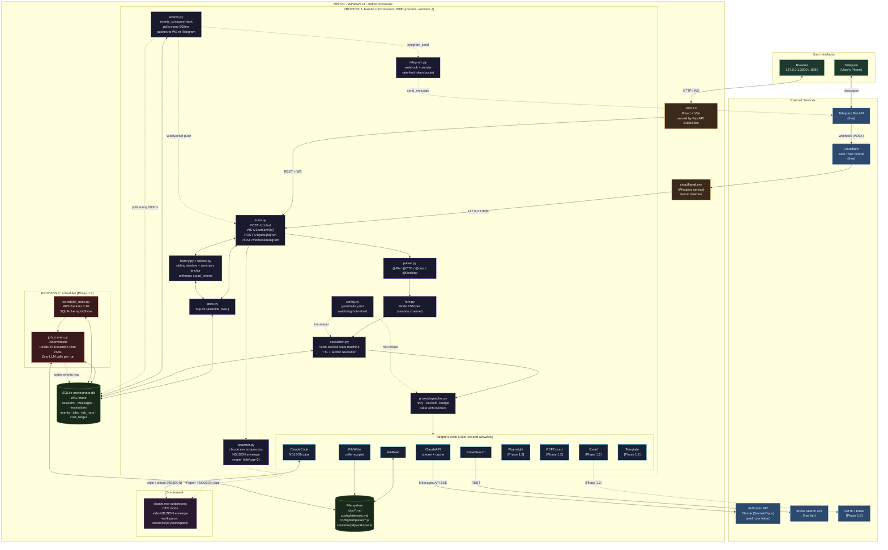

# Personal Assistant Orchestrator — Architecture Diagram (v3)



---

## Component Index

| Component | Path | Process | Role |
|-----------|------|---------|------|
| **Web UI** | `web-ui/src/` | served by FastAPI | React terminal, WS client |
| **FastAPI app** | `orchestrator/main.py` | Process 1 (uvicorn --workers 1) | Routes, lifespan, events_consumer |
| **Intent parser** | `orchestrator/parser.py` | Process 1 | `@command` detection, intent kind |
| **Mode FSM** | `orchestrator/fsm.py` | Process 1 | PA / CTO / DESKTOP per (session, channel) |
| **Escalation engine** | `orchestrator/escalation.py` | Process 1 | Table-backed state machine, TTL, atomic resolve |
| **Dispatcher** | `orchestrator/proxy/dispatcher.py` | Process 1 | Adapter routing, retry, budget, caller enforcement |
| **SQLite store** | `orchestrator/store.py` | Process 1 (and 2 read-only) | aiosqlite, WAL, busy_timeout=5s |
| **History/tokens** | `orchestrator/history.py`, `tokens.py` | Process 1 | Sliding window + summary anchor + count_tokens |
| **Spawner/reaper** | `orchestrator/spawner.py` | Process 1 | claude.exe lifecycle, hard cap 2 |
| **Telegram** | `orchestrator/telegram.py` | Process 1 | Webhook + sender + rate limit |
| **events_consumer** | `orchestrator/events.py` | Process 1 (asyncio task) | Polls events table, pushes to WS/Telegram |
| **Scheduler** | `orchestrator/scheduler_main.py` | Process 2 (Phase 1.2) | APScheduler 3.10 + SQLAlchemyJobStore |
| **Job runner** | `orchestrator/job_runner.py` | Process 2 (Phase 1.2) | Deterministic Execution Plan executor |
| **Adapters** | `orchestrator/proxy/adapters/*.py` | invoked from either process | Caller-scoped tools |
| **claude.exe** | system PATH | spawned per CTO session | Sub-agent (NDJSON envelope) |
| **cloudflared.exe** | Windows service | independent | Public ingress for Telegram webhook |
| **SQLite DB** | `orchestrator.db` | shared (WAL) | All persistent state + cross-process events channel |

---

## Data Flow Summaries

### User chat (web)
```
Browser ──→ WebUI ──→ FastAPI /v1/chat
                          │
                          ▼
                   parser → fsm → escalation_check
                          │
                          ▼
                   (if pending escalation matches reply → resolve atomic)
                   (if not → dispatcher → adapter)
                          │
                          ▼
                   ClaudeAPIAdapter (stream) ──→ AnthropicAPI
                          │
                          ▼
                   tokens written to messages table
                   cost written to cost_ledger
                          │
                          ▼
                   stream back via WS to Browser
```

### User chat (Telegram)
```
TG client → Telegram Bot API → cloudflared → /webhook/telegram
                                                  │
                                                  ▼
                                          (same chain as web)
                                                  │
                                                  ▼
                                          telegram.send_message → Telegram → TG client
```

### CTO sub-agent invocation
```
@CTO write hello.py
        │
        ▼
spawner.spawn(session_id, brief_context):
   - generate brief via ONE Claude call
   - write sessions/{id}/.claude/CLAUDE.md
   - Popen claude.exe
        │
        ▼
First user message → stdin
        │
        ▼
claude.exe writes NDJSON envelope on stdout:
   {"phase": "plan", "needs_confirmation": true, ...}   ← creates escalation
   {"phase": "action", ...}                              ← streamed to user
   {"phase": "result", "summary_needed": false, ...}    ← templated wrap-up
        │
        ▼
PA wrapper templates → user (deterministic, no extra LLM call)
        │
        ▼
(only if summary_needed=true → ONE additional Claude call via ClaudeAPIAdapter)
```

### Scheduled job (Phase 1.2)
```
APScheduler (Process 2) fires cron
        │
        ▼
job_runner.run(job_id):
   - Load jobs/{name}.md
   - Verify plan_checksum (mismatch → escalation event)
   - Validate ## Execution Plan against adapter manifests
   - Execute steps deterministically (NO Claude call)
        │
        ▼
job_runs row written
events row inserted (kind: job_complete)
        │
        ▼
Process 1 events_consumer (polls every 500ms)
        │
        ▼
Web UI WebSocket push  +  Telegram send_message
```

### Error escalation
```
Adapter returns Result(ok=False, retriable=...)
        │
        ▼
After max_attempts:
   - escalation.create(session_id, options={a: retry, b: skip})
   - emit prompt to user
        │
        ▼
Next inbound message:
   - escalation.pending_for(session) → match candidate key
        │
        ├─ match → atomic resolve → execute branch
        ├─ non-match → cancel + passthrough as new message
        └─ TTL expired → auto-skip + event notification
```

---

## Notes on the v3 architecture (vs v1 with Docker)

| Concern | v1 (Docker) | v3 (native) |
|---------|-------------|-------------|
| Process model | 6 containers via Docker Compose | 2 native Windows processes (uvicorn + scheduler) |
| Session store | Redis 7 (container) | SQLite + WAL |
| Mobile surface | Twilio + WhatsApp connector container | Telegram Bot API directly |
| Cross-worker pubsub | Redis pub/sub | SQLite events table polled by single uvicorn worker |
| Sub-agent output | Free-text + sentinel | NDJSON envelope, parsed deterministically |
| Job execution | LLM call per fire | One LLM call at create; deterministic at fire |
| Escalation state | Single column | Dedicated table with TTL and atomic resolve |
| File write security | Plan v2 had simple allowlist | v3: caller-scoped allowlists + atomic writes |
| Memory footprint | ~1.8 GB | ~250 MB |
| Startup | `docker compose up` | `run.ps1` |
| Worker count | 2 uvicorn workers per service | 1 uvicorn worker (eliminates cross-worker push problem) |
